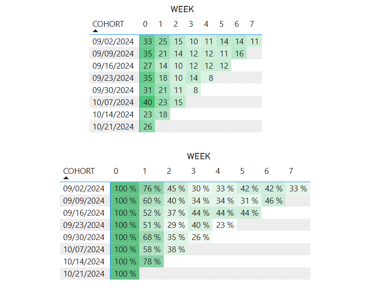

# Weekly User Retention Analysis

This repository contains a simulation and analysis of weekly user retention behavior based on e-commerce order data. The goal is to understand how user engagement evolves over time after their first purchase, by generating realistic sample data and computing cohort retention metrics.

## Project Context

Retention analysis is a key technique in understanding user behavior, product stickiness, and business growth. In this case study, we simulate a transactional dataset with realistic patterns, where each user places multiple orders over time — but not necessarily in consecutive weeks. The focus is on identifying how many users remain active in the weeks following their initial purchase.

---

## Step 1: Simulated Order Data Creation

We generate synthetic data for:
- **250 unique users**
- **10,000 total orders**
- Spread across **8 consecutive weeks**

### Key Characteristics:
- Each user has a randomly assigned first purchase week (ensuring coverage across all 8 weeks).
- Subsequent orders are distributed randomly from the user's first purchase week onward.
- Not all users order every week — the data reflects irregular purchase behavior, which mimics real-world user engagement patterns.
- The final dataset includes `user_id`, `order_id`, and `order_date`.

---

## Step 2: Cohort Retention Table

We define a **cohort** as the week in which a user makes their **first purchase**.

### Logic:
- For each user, we identify the first week they made a purchase (`cohort_week`).
- A **retained user** in week *x* must have at least one order in both week *x-1* and week *x*.
- The resulting table tracks user activity week by week and allows us to build a cohort retention matrix.

### Output columns include:
- `user_id`
- `cohort_week`
- `week_number` (relative to the cohort)
- Flags for each week where the user is considered retained

---

## Step 3: Weekly Retention Matrix Analysis

To visualize user engagement over time, we generate two cohort retention matrices:

### Absolute Retention Counts
This matrix shows the number of users from each cohort (users grouped by their first purchase week) who returned in each subsequent week. It highlights how activity drops off over time for each cohort.

### Relative Retention Percentages
This matrix normalizes the data by showing the percentage of users retained relative to their cohort's size. It offers a clearer comparison across different cohorts, regardless of their original size.

### Key Observations
- Retention tends to drop sharply after the first week, which is a common pattern in digital products.
- Some cohorts exhibit slightly better long-term retention (e.g., 09/09/2024 and 09/16/2024)
- Later cohorts (e.g., 10/14/2024 and 10/21/2024) are still too recent to observe full retention behavior.

### Insights:

- The sharpest drop consistently occurs between Week 0 and Week 1, highlighting a potential issue in post-purchase activation or product value perception.
- After Week 2, most cohorts tend to stabilize at low retention levels, suggesting that if a user doesn’t return early, they likely won’t return at all.
- The cohort from 09/16/2024 shows a highly stable retention between Week 2 and Week 5 (all near 44%), which may indicate a high-quality user segment.
- Users retained in Week 1 show moderate chances of staying active in Weeks 2 to 5 — interventions right after the first purchase could help boost overall retention.
